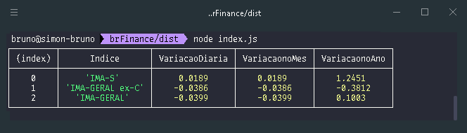
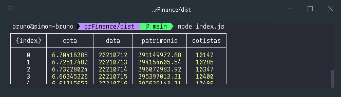

 

# BrFinance: Node.JS

[![Contributors][contributors-shield]][contributors-url]
[![Forks][forks-shield]][forks-url]
[![Stargazers][stars-shield]][stars-url]
[![Issues][issues-shield]][issues-url]
[![MIT License][license-shield]][license-url]
[![LinkedIn][linkedin-shield]][linkedin-url]
[![Twitter URL][twitter-shield]][twitter-url]

<!-- toc -->

-   [🗒 Description](#-description)
-   [🚀 Getting Started Tutorial](#-getting-started-tutorial)
-   [✨ Features](#-features)
-   [📌 Requirements](#-requirements)
-   [📚 Usage & Examples](#-usage--examples)
-   [🏭 Related Repositories](#-related-repositories)
-   [📣 Feedback & Contact](#-feedback--contact)
<!-- tocstop -->

# 🗒 Description

brFinance is Node.JS web scraping package to simplify access to financial data. It provides data from various sources such as CVM (brazilian equivalent of SEC), B3 (Brazilian stock exchange), Banco Central (brazilian equivalent of FED), ANBIMA, etc.

# 🚀 Getting Started Tutorial

1. Install the package
    ```sh
    yarn add brfinance
    ```
    or
    ```sh
    npm install brfinance
    ```

# ✨ Features

<!-- TODO
* **Financial statements**
* * Balanço Patrimonial Ativo (Balance sheet - Assets)
* * Balanço Patrimonial Passivo (Balance sheet - Liabilities)
* * Demonstração do Resultado  (Income statement)
* * Demonstração do Resultado Abrangente
* * Demonstração do Fluxo de Caixa (Cash flow statement)
* * Demonstração das Mutações do Patrimônio Líquido
* * Demonstração de Valor Adicionado
-->

-   **Banco central PTAX** - Average trade price for currencies in BRL

-   **ANBIMA IMA Index** - Brazilian bonds index

# 📌 Requirements

Currently, Node 8+ is supported. We support the [LTS versions](https://nodejs.org/en/about/releases) of Node.

# 📚 Usage & Examples

-   **PTAX**:

```js
const brFinance = require('brfinance')

async function main() {
    const ptax = await brFinance.ptax(20210501, 20210510)
    console.table(ptax)
}
main()
```

\
&nbsp;

-   **ANBIMA Index**:

```js
const brFinance = require('brfinance')

async function main() {
    const indices = await brFinance.indicesAnbima(20210701, 20210705)
    console.table(
        indices.slice(-3).map((e) =>
            (({ Indice, VariacaoDiaria, VariacaonoMes, VariacaonoAno }) => ({
                Indice,
                VariacaoDiaria,
                VariacaonoMes,
                VariacaonoAno,
            }))(e),
        ),
    )
}
main()
```

\
&nbsp;

-   **COTA Investment Fund**:

```js
const brFinance = require('brfinance')

async function main() {
    const cota = await cotaFundo('09143435000160')
    console.table(cota.slice(-5))
}
main()
```



# 🏭 Related Repositories

-   [@eudesrodrigo/brFinance](https://github.com/eudesrodrigo/brFinance) - brFinance in Python.

# 📣 Feedback & Contact

If you have any suggestions or want to let us know what you think about the project, send us a message at [![Twitter URL][twitter-shield-msg]][twitter-url]

[contributors-shield]: https://img.shields.io/github/contributors/lobobruno/brFinance.svg?style=for-the-badge
[contributors-url]: https://github.com/lobobruno/repo/graphs/contributors
[forks-shield]: https://img.shields.io/github/forks/lobobruno/brFinance.svg?style=for-the-badge
[forks-url]: https://github.com/lobobruno/repo/network/members
[stars-shield]: https://img.shields.io/github/stars/lobobruno/brFinance.svg?style=for-the-badge
[stars-url]: https://github.com/lobobruno/repo/stargazers
[issues-shield]: https://img.shields.io/github/issues/lobobruno/brFinance.svg?style=for-the-badge
[issues-url]: https://github.com/lobobruno/repo/issues
[license-shield]: https://img.shields.io/github/license/lobobruno/brFinance.svg?style=for-the-badge
[license-url]: https://github.com/lobobruno/repo/blob/master/LICENSE.txt
[linkedin-shield]: https://img.shields.io/badge/-LinkedIn-black.svg?style=for-the-badge&logo=linkedin&colorB=555
[linkedin-url]: https://linkedin.com/in/lobobruno
[twitter-shield]: https://img.shields.io/twitter/url/https/twitter.com/brunowlf.svg?style=social&label=Follow%20%40brunowlf
[twitter-shield-msg]: https://img.shields.io/twitter/url/https/twitter.com/brunowlf.svg?style=social&label=%20%40brunowlf
[twitter-url]: https://twitter.com/brunowlf
